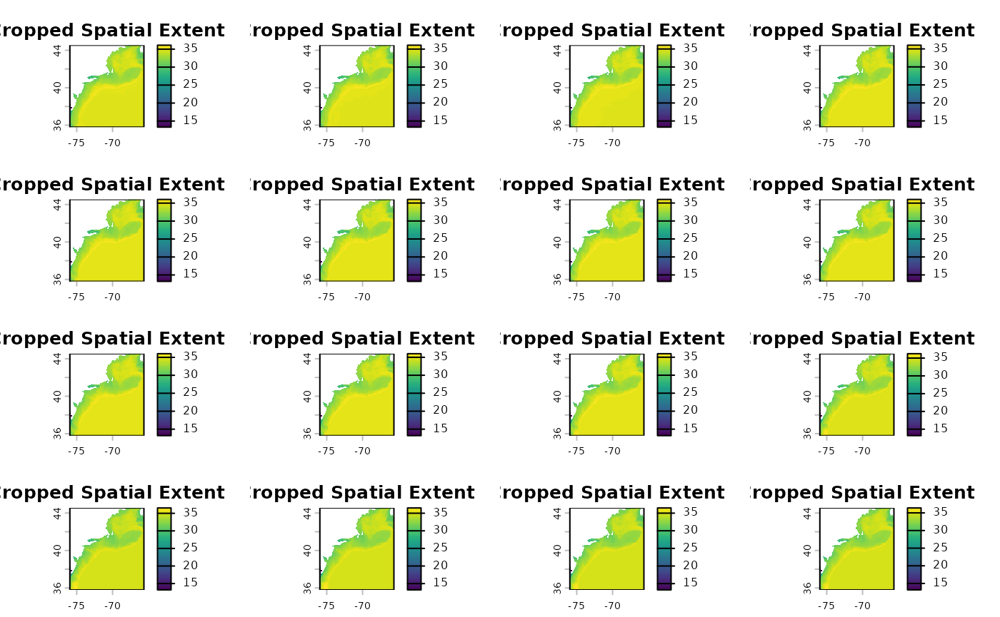
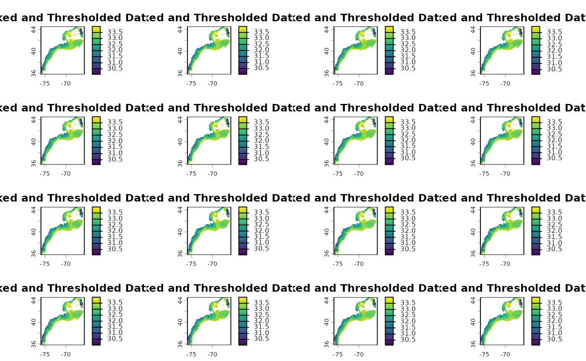

# 2D Timeseries

## Pipeline Workflow Overview

The `EDABUtilities` package provides a continuous, memory-efficient
pipeline to transform raw spatial data (like large NetCDF files) into
actionable, tabular time series data.

This vignette demonstrates the *Timeseries Pipeline* (`_ts`), which
generally follows a 6-step progression:

1.  *Spatial Cropping* (`crop_nc_2d`): Load raw spatial files and
    immediately crop them to the bounding box of your study area to
    conserve memory.

2.  *Quality Masking* (`mask_nc_2d`): Filter out unreasonable values
    (e.g., out-of-bounds salinity or landmass artifacts) and strictly
    mask the data to the polygon boundaries.

3.  *Temporal Aggregation* (`make_2d_summary_ts`): Transition from
    spatial arrays to tabular time series. We summarize the spatial data
    by region (e.g., taking the mean over a polygon) and by time (e.g.,
    daily layers to monthly averages).

4.  *Climatology Baseline* (`make_2d_climatology_ts`): Filter the
    aggregated time series by specific reference periods (like summer
    months) to establish a baseline climatology.

5.  *Anomaly Calculation* (`make_2d_anomaly_ts`): Compare the aggregated
    time series against the baseline climatology to calculate the final
    anomalies.

6.  *Degree-Day Thresholds* (`make_2d_deg_day_ts`): Calculate the number
    of days above or below a reference threshold (e.g., salinity \> 33)
    for each region and time period.

### Step 0: Setup and Define Parameters

First, we load the required packages and define our core parameters,
including our study area shapefile (Ecological Production Units - EPUs)
and our variable of interest (Bottom Salinity).

``` r

library(here)
#> Error in `library()`:
#> ! there is no package called 'here'
library(EDABUtilities)
library(ggplot2)
#> Error in `library()`:
#> ! there is no package called 'ggplot2'
library(dplyr)
#> 
#> Attaching package: 'dplyr'
#> The following objects are masked from 'package:stats':
#> 
#>     filter, lag
#> The following objects are masked from 'package:base':
#> 
#>     intersect, setdiff, setequal, union

# Define reference boundaries and thresholds
epu.shp <- system.file('data', 'EPU_NOESTUARIES.shp', package = 'EDABUtilities')
var.name <- 'BottomS'
min.S <- 30
max.S <- 34
```

### Step 1: Spatial Cropping

We start by reading in our daily NetCDF files. To save processing time
downstream, we use crop_nc_2d to immediately crop the rasters to the
bounding box of our shapefile.

``` r


data.crop <- EDABUtilities::crop_nc_2d(
  data.in = c(system.file('data', 'GLORYS_daily_BottomSalinity_2019.nc', package = 'EDABUtilities'),
              system.file('data', 'GLORYS_daily_BottomSalinity_2020.nc', package = 'EDABUtilities')),
  shp.file = epu.shp,
  var.name = var.name,
  area.names = NA,
  write.out = FALSE
)
#> Already standard format (-180:180)
#> Already standard format (-180:180)

terra::plot(data.crop[[2]], main = "Cropped Spatial Extent")
```



### Step 2: Maksing and Quality control

Next, we filter the cropped data to only include valid salinity values
(between 30 and 34) and mask out any water that falls outside our
precise EPU polygons.

``` r


data.mask <- mask_nc_2d(
  data.in = data.crop,
  var.name = var.name,
  min.value = min.S,
  max.value = max.S,
  shp.file = epu.shp,
  binary = FALSE,
  write.out = FALSE
)

terra::plot(data.mask[[1]], main = "Masked and Thresholded Data")
```



### Step 3: Transition to Timeseries Aggregation

Here, the pipeline shifts from spatial rasters (`SpatRaster`) to tabular
data (`data.frame`). We aggregate the daily spatial layers into regional
monthly averages specifically for the Mid-Atlantic Bight (MAB), Georges
Bank (GB), and Gulf of Maine (GOM).

``` r

data.ts = make_2d_summary_ts(data.in = data.mask,
                           shp.file = epu.shp,
                           var.name = var.name,
                           agg.time ='months',
                           statistic = 'mean',
                           file.time = 'annual',
                           area.names = c('MAB','GB','GOM'),
                           write.out = F)

# Combine the list of dataframes for plotting
ts_all <- dplyr::bind_rows(data.ts)

ggplot(ts_all, aes(x = time, y = value,color = factor(ls.id))) +
  geom_line() +
  facet_wrap(~area) +
  theme_minimal() +
  labs(title = "Monthly Mean Bottom Salinity by Region")
#> Error in `ggplot()`:
#> ! could not find function "ggplot"
```

### Step 4: Establish a Climatology Baseline

Using the aggregated tabular data, we establish a baseline climatology.
In this example, we calculate the long-term mean specifically for the
summer months (June through August).

``` r

clim.ts <- make_2d_climatology_ts(
  data.in = data.ts,
  start.time = 6,
  stop.time = 8,
  statistic = "mean",
  write.out = FALSE
)

ggplot(clim.ts[[1]], aes(x = time, y = value, fill = area)) +
  geom_bar(linewidth = 1,stat = 'identity',position = 'dodge') +
  theme_minimal() +
  labs(title = "Summer Climatology Baseline")
#> Error in `ggplot()`:
#> ! could not find function "ggplot"
```

### Step 5: Calculate Anomalies

Then, we calculate the anomalies by subtracting our summer climatology
baseline from the original aggregated timeseries. Note:
`make_2d_climatology_ts` returns a list, so we pass the first dataframe
into the anomaly function.

``` r

anom.ts <- make_2d_anomaly_ts(
  data.in = data.ts,
  climatology = clim.ts[[1]], 
  write.out = FALSE
)
#> Warning in make_2d_anomaly_ts(data.in = data.ts, climatology = clim.ts[[1]], :
#> Some observations in item 1 did not match the climatology and resulted in NA
#> anomalies.
#> Warning in make_2d_anomaly_ts(data.in = data.ts, climatology = clim.ts[[1]], :
#> Some observations in item 2 did not match the climatology and resulted in NA
#> anomalies.

anom_all <- dplyr::bind_rows(anom.ts)

ggplot(anom_all, aes(x = time, y = anom.value, color = area)) +
  geom_hline(yintercept = 0, linetype = "dashed", color = "gray50") +
  geom_line(linewidth = 1) +
  facet_wrap(~ls.id, labeller = label_both) +
  theme_minimal() +
  labs(title = "Salinity Anomalies from Summer Climatology")
#> Error in `ggplot()`:
#> ! could not find function "ggplot"
```

## Step 6: Degree-Day Thresholds

If you are investigating specific threshold events (like marine
heatwaves or extreme salinity events), you can skip standard anomaly
calculations and use `make_2d_deg_day_ts`. This function counts the
number of days (`nd`), consecutive days (`nd.con`), or degree days
(`dd`) above or below a specific reference point.

Here, we calculate the number of days the Bottom Salinity was above
`33`.

``` r

data.nday <- make_2d_deg_day_ts(
  data.in = data.crop,
  var.name = "BottomS",
  statistic = "nd",
  ref.value = 33,
  type = "above",
  shp.file = epu.shp,
  area.names = c("MAB", "GB"),
  write.out = FALSE
)

data.nday.all <- dplyr::bind_rows(data.nday)

ggplot(data.nday.all, aes(x = ls.id, y = value, fill = area)) +
  geom_bar(stat = "identity", position = "dodge") +
  theme_minimal() +
  labs(title = "Number of Days with Salinity > 33",
       x = "Year (Dataset ID)",
       y = "Number of Days")
#> Error in `ggplot()`:
#> ! could not find function "ggplot"
```
